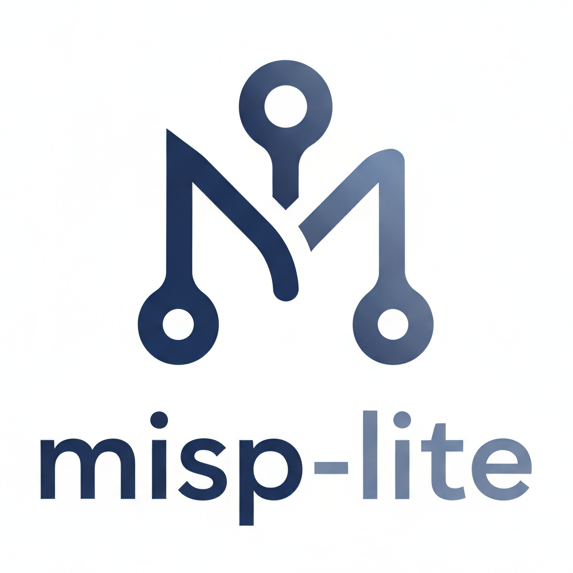

# misp-lite

<p align="center">
    
</p>
This repository provides a lightweight MISP-compatible stack: a Python backend API with Celery background workers, a Vue.js frontend, and supporting services — OpenSearch for indexed attributes and correlation results, Redis for task brokering and caching/notification state, and MinIO for attachment storage — all orchestrated via Docker Compose to enable local development, feed ingestion, correlation generation, and notification processing.

Some screenshots are available [here](docs/screenshots/). 

### Features
- **Correlations**: batch and incremental correlation generation scans attributes in OpenSearch and creates correlated attribute records. Correlation work is implemented in the backend and scheduled/executed via Celery tasks; results are surfaced in the frontend UI.
- **Notifications**: events and notable changes (for example newly created correlations) are queued and delivered through the backend notification subsystem; notification tasks are processed by Celery workers and can be backed by Redis for delivery/state tracking.
- **Feed sync and MISP integration**: the backend supports syncing with external feed sources and MISP services to ingest indicators and metadata. Sync processes run as background tasks and store feed items in OpenSearch and the attachments store; feeds can be used as correlation sources and for notifications.
- **API (FastAPI)**: a FastAPI-based backend exposing REST/JSON endpoints and automatic OpenAPI documentation; async handlers and Pydantic models are used for validation, serialization, and dependency injection. The API is served (in production/dev) via an ASGI server (e.g., Uvicorn) and is the primary integration point for the frontend, feeds, and external services.
- **OpenSearch**: used to index and search attributes, correlation results, and feed items. It provides mappings, analyzers, aggregations, and query APIs the backend relies on for fast lookups, correlation scans, and persisted feed data; configured for local dev via docker-compose.
- **OpenSearch Dashboards**: an optional visualization and exploration UI that connects to OpenSearch for inspecting indexed data, building queries, and creating dashboards to aid debugging, analytics, and operational monitoring.
- **Storage & attachments**: OpenSearch stores indexed attributes and correlation results; MinIO (or compatible S3) is used for attachment storage when configured.

### Quick start

1. Start the development stack (uses compose files in the repo):

```bash
# from repository root
git submodule update --init --recursive
docker compose -f docker-compose.yml -f docker-compose.dev.yml --env-file=".env.dev" up --build
```

The dev compose file configures the API, frontend, OpenSearch, Redis, and other services needed to run the project locally.

####  Local development (alternative)

- **Frontend**
    - cd `frontend/`
    - install and run the dev server (npm/yarn):
        ```bash
        npm install
        npm run dev
        ```

- **Backend**
    - see `api/README.md` for dependency installation and local server commands. The Python project is defined in `api/pyproject.toml` (poetry or pip can be used to install dependencies).

#### Celery / background workers

The project uses Celery for background tasks. In development the worker is started via docker compose. To run a worker locally (dev environment) you can run:

```bash
# run from the environment where the project's Python dependencies are available
celery -A api.app.worker.tasks worker --loglevel=info --pool=solo --concurrency=1
```

### Testing

- Frontend tests and end-to-end scripts are located under `frontend/` (see `frontend/README.md`).
- Backend tests and migration helpers are documented in `api/README.md`.

### Configuration

- Dev environment variables are read from `.env.dev` when using the provided docker-compose override. Other environment configuration and sensitive values are documented in `api/README.md` and `frontend/README.md`.

### Contributing

If you want to contribute, start by reading the component READMEs (`api/README.md`, `frontend/README.md`) and run the development stack locally. Follow the project's coding style and add small, focused pull requests.


### License

This project is available under the terms in `LICENSE`.
