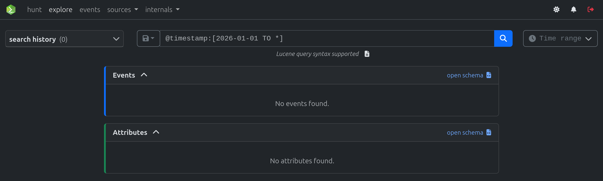
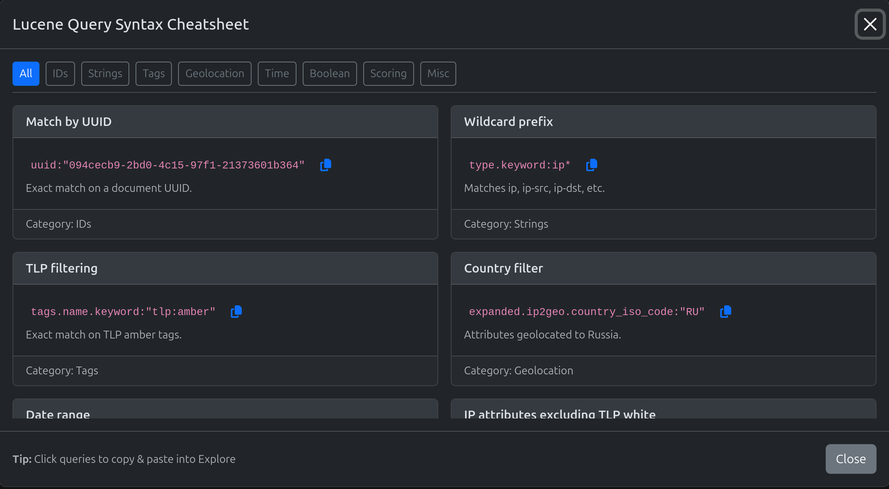

# Explore

The Explore view provides an interactive search interface over the OpenSearch indices. It lets you issue ad-hoc Lucene queries against events and attributes, filter results by time, and promote any search into a persistent [Hunt](hunts.md).

## Search bar

Queries are written in **Lucene query syntax** and executed simultaneously against the `misp-events` and `misp-attributes` indices. Results from whichever index has hits appear first.

Press **Enter** or click the search button to run the query.

### Example queries

| Query | What it finds |
|---|---|
| `info:banking` | Events whose title contains "banking" |
| `type.keyword:ip*` | Attributes whose type starts with `ip` |
| `expanded.ip2geo.country_iso_code:"RU"` | Attributes whose enriched geo data resolves to Russia |
| `@timestamp:[2026-01-01 TO *]` | Documents indexed from 2026 onwards |
| `"admin@example.com"` | Exact phrase match across all fields |
| `tags.name.keyword:"tlp:amber"` | Events or attributes tagged TLP:AMBER |
| `uuid:"094cecb9-..."` | Lookup by UUID |

Clicking on ***Lucene query syntax supported*** button opens a Lucene cheatsheet.

## Time range filter

The time range picker constrains results to a specific window. It appends a `@timestamp` range clause to your query automatically.

**Relative** mode offers quick presets (Last 15 minutes → Last 1 year) or a custom value + unit picker.

**Absolute** mode lets you pick exact from/to timestamps with a date-time picker.

To remove the time filter, click the × next to the active range label.

## Search history

The sidebar panel tracks two lists:

| List | Storage | Max entries |
|---|---|---|
| **Recent** | Browser `localStorage` | 10 |
| **Saved** | User settings (`explore.saved_searches`) | Unlimited |

Recent searches are added automatically when you run a new query. You can promote a recent search to saved (persisted server-side) by clicking the floppy disk icon next to it.

You can re-run a search by clicking on it from the search history panel.

## Saving a search as a Hunt

Any query — including the active time range filter — can be turned into a Hunt directly from the search bar.

1. Type or select a query.
2. Click the **save** dropdown (floppy disk icon) → **Save as Hunt**.
        
3. The current query (plus any `@timestamp` range clause) is pre-filled in the Hunt creation modal.
4. Give the hunt a name and confirm. The hunt is immediately available in the [Hunts](hunts.md) view.

This lets you graduate an ad-hoc investigation into a recurring, scheduled search with match-count tracking and notifications.

## Exporting results

Each result section (Events, Attributes) has a download button that exports **all matching documents** (not just the current page) as a JSON file.

The filename includes the entity type and a timestamp, e.g. `misp-workbench-attributes-2026-03-11T10-00-00.json`.

## API

The Explore view drives two search endpoints:

| Method | Path | Description | Scopes |
|---|---|---|---|
| `GET` | `/events/search` | Search the `misp-events` index | `events:read` |
| `GET` | `/attributes/search` | Search the `misp-attributes` index | `attributes:read` |

Both accept a `query` parameter (Lucene string) and standard `page` / `size` pagination.
