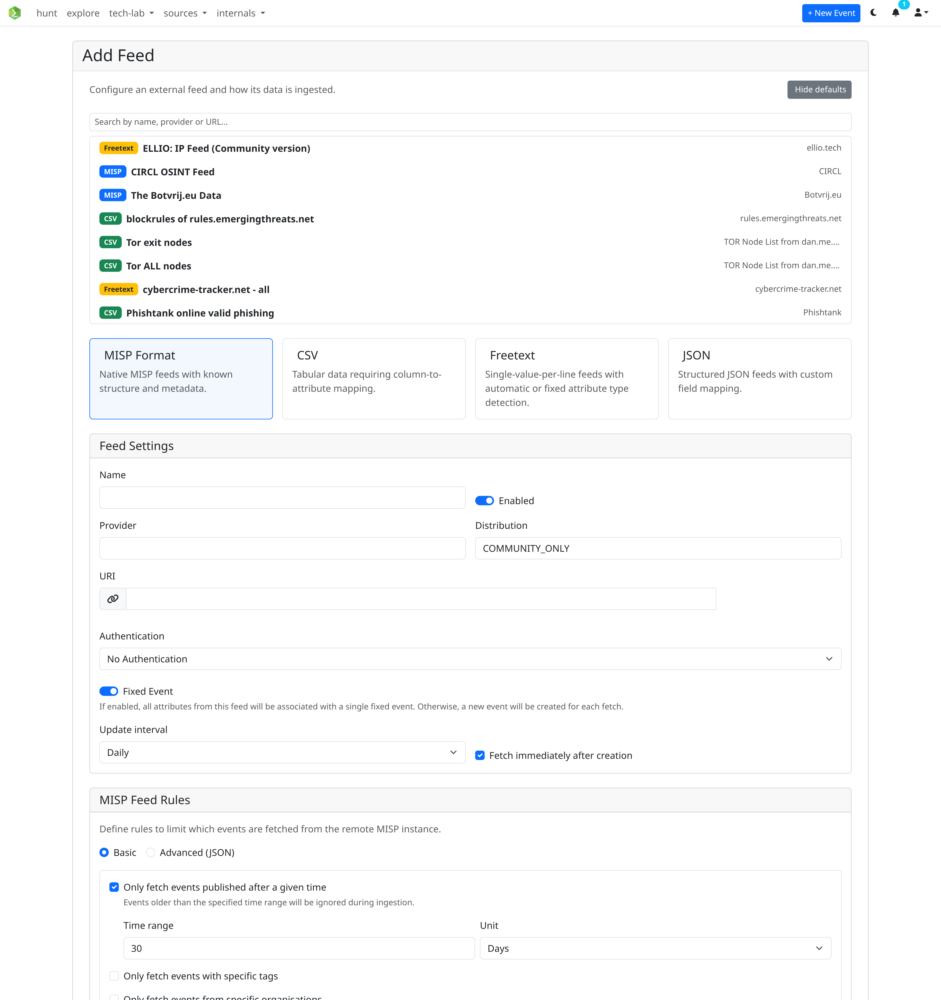

# Feeds

misp-workbench supports four feed source formats. Each feed is fetched either on demand or on a configurable schedule (hourly, daily, weekly).

| Format | Description |
|---|---|
| [MISP](misp.md) | Full MISP feed — events with attributes, objects, tags, and galaxies |
| [CSV](csv.md) | Delimited text file — one indicator per row, configurable column mapping |
| [JSON](json.md) | JSON array, object, or NDJSON — dot-notation field mapping |
| [Freetext](freetext.md) | Plain text — one indicator per line, type auto-detected or fixed |

## Common settings

All feed types share a set of base settings:

| Field | Description |
|---|---|
| **Name** | Display name for the feed |
| **Provider** | Organisation or source name |
| **URL** | Remote URL of the feed |
| **Distribution** | MISP distribution level for ingested attributes |
| **Enabled** | Whether the feed is active |
| **Fixed Event** | If on, all fetches append to a single event; if off, a new event is created per fetch |
| **Update interval** | Automatic fetch schedule (hourly / daily / weekly / disabled) |
| **Fetch immediately** | Enqueue an immediate fetch when the feed is created |

## Default feed list

A curated list of well-known public feeds is bundled at `api/app/defaults/default-feeds.json`. When adding a feed, click **Select from defaults** to browse and auto-populate the form.

## Scheduled tasks

Each feed with an update interval creates a **RedBeat** scheduled task in Redis. Scheduled tasks can be viewed and managed in the Tasks section of the UI or directly in Flower at http://localhost:5555.

Deleting a feed also deletes all its associated scheduled tasks.
