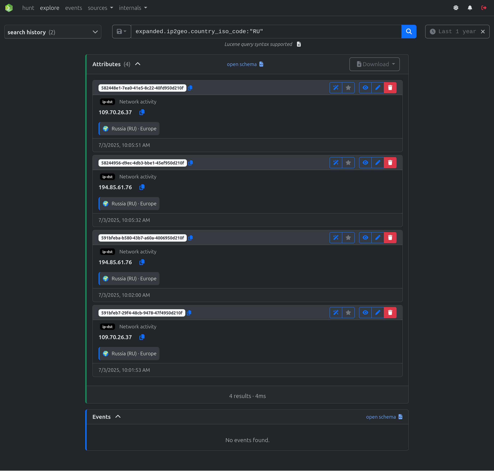
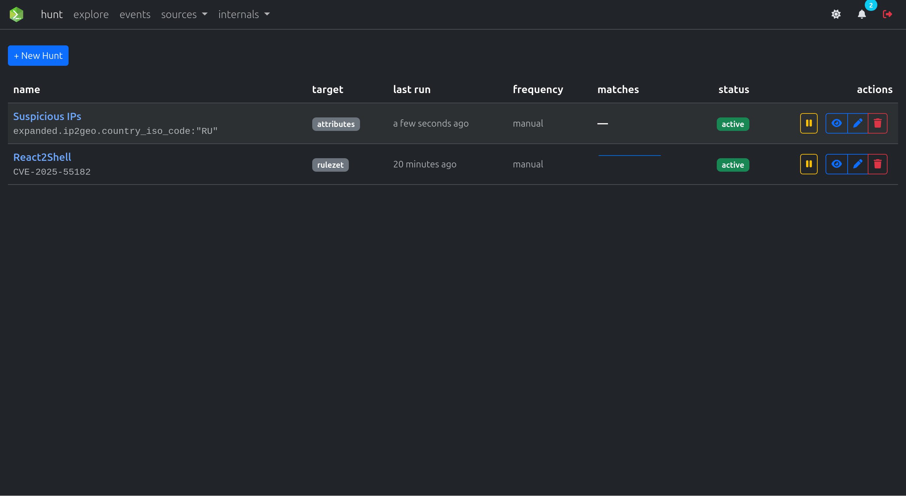
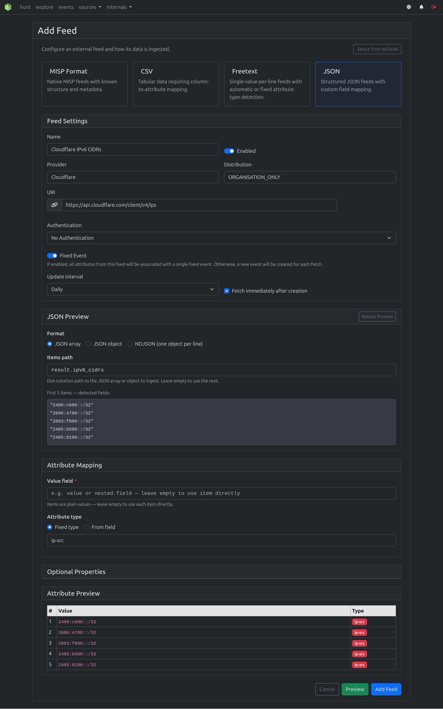

# misp-workbench

A modern MISP-compatible threat intelligence platform. It provides a self-contained solution for ingesting, correlating, and analysing threat intelligence data — without requiring a full MISP instance.

## Features

| Feature | Description |
|---|---|
| **Feed ingestion** | Ingest MISP, CSV, JSON, and Freetext feeds on a schedule or on demand |
| **Correlations** | Batch and incremental correlation scans over indexed attributes |
| **Search & hunts** | Lucene queries against OpenSearch for fast indicator lookups |
| **Notifications** | Event-driven notifications processed by Celery workers |
| **REST API** | FastAPI backend with automatic OpenAPI documentation |
| **Storage** | Garage (S3-compatible) or local filesystem for attachments |

## Screenshots

=== "Explore"
    Browse and search MISP events and attributes using Lucene queries.

    

=== "Hunts"
    Define saved searches to proactively hunt for indicators of interest.

    

=== "Sources"
    Manage feed sources: JSON, CSV, Freetext and MISP.

    

## Quick links

- [Getting Started](getting-started.md)
- [Configuration reference](configuration.md)
- [Architecture overview](architecture.md)
- [Feed types](feeds/index.md)
- [Development guide](development.md)
