# misp-workbench — Hands-on Tutorial

This tutorial walks you through the main features of **misp-workbench** end to end, following a single realistic scenario. By the end you will have:

1. Connected a remote **MISP server** and pulled events from it.
2. Added an external **feed** and ingested indicators on a schedule.
3. Searched your data in the **Explore** view with Lucene queries.
4. Turned a search into a recurring **Hunt** with match tracking and alerts.
5. Explored the data interactively in an **analyst notebook** (Tech Lab).
6. Enriched indicators with **misp-modules**.
7. Connected an AI assistant through the **MCP server**.
8. Created your own **event**, exported it, and enabled **correlations**.

> **Scenario.** You are an analyst at *ACME-CERT*. You want to stand up a self-contained threat-intel workbench that (a) syncs curated events from a partner MISP instance, (b) ingests a public blocklist feed, and (c) lets you hunt for indicators tied to a ransomware campaign you are tracking.

---

## 0. Before you start

Make sure the stack is running and you can log in. From the repo root:

```bash
cp .env.dev.dist .env.dev          # set OPENSEARCH_INITIAL_ADMIN_PASSWORD at minimum
cp frontend/.env.dist frontend/.env
docker compose -f docker-compose.yml -f docker-compose.dev.yml --env-file=".env.dev" up --build
```

Create an organisation and an admin user, then log in:

```bash
docker compose exec api poetry run python -m app.cli create-organisation "ACME-CERT"
docker compose exec api poetry run python -m app.cli create-user admin@acme.test password --org-name "ACME-CERT" --role-id 1
```

Open **http://localhost:3000/login** and sign in.

### The top navigation

Everything in this tutorial hangs off the main navbar:

| Menu | What's under it |
|---|---|
| **hunt** | Saved, scheduled searches (`/hunts`) |
| **explore** | Lucene search over events, attributes, and correlations (`/explore`) |
| **tech-lab** | *reactor scripts* and *notebooks* |
| **sources** | *feeds* and *MISP servers* |
| **internals** | users, organisations, roles, modules, taxonomies, galaxies, correlations, exports, **tasks**, diagnostics, settings, API keys, audit logs |
| **+ Add Event** | Top-right — create an event manually |

There is no dedicated *events* or *attributes* menu — you reach individual records through **explore** or by following links.

---

## 1. Connect a remote MISP server

**Goal:** pull curated events from a partner MISP instance into your workbench.

Go to **sources → MISP servers** (`/servers`), then click **+ Add Server**.

### Fill in the connection

| Field | Value in our scenario | Notes |
|---|---|---|
| **Name** | `Partner MISP` | Display name |
| **URL** | `https://misp.partner.example` | The remote MISP base URL |
| **API authkey** | *(your remote API key)* | From the remote MISP under *My Profile → Auth keys* |
| **Organisation** | `ACME-CERT` | The **local** org that owns this connection |
| **Remote Organisation** | `PARTNER-ORG` | The org on the remote side |
| **Pull** | ✅ on | We want to *fetch* events |
| **Push** | ⬜ off | We are not publishing back (yet) |

Under **Pull Rules** (Basic mode) narrow down what you fetch:

- ✅ *Only pull events published after a given time* → `30` **Days**
- optionally ✅ *Only pull events with specific tags* → e.g. `tlp:white`, `tlp:green`
- optionally ✅ *Only pull events from specific organisations*

Advanced (JSON) mode accepts the same rules directly:

```json
{ "timestamp": "30d", "tags": ["tlp:white", "tlp:green"], "orgs": ["PARTNER-ORG"] }
```

The **Advanced Options** section holds less-common toggles — **Self Signed** (accept self-signed TLS), **Skip Proxy**, **Internal**, **Pull Galaxy Clusters**, **priority**, and so on. Leave the defaults for now.

### Validate before saving

Click **Preview**. This calls the remote server with your URL + authkey + pull rules and shows a **Pull Preview** modal:

- **Total events on remote server**
- **Events matching pull rules**

If the numbers look right, click **Add Server**.

### Sync

Back on the server list, each server row has an action group:

- **Check connection** — verifies URL + authkey (turns green on success, red on failure).
- **Pull** — enqueues an asynchronous pull (toast: *"Server pull enqueued."*). This runs as a Celery task in the background.
- **Push** — only shown if push is enabled.
- **Explore** (magnifying glass) — browse remote events *without* importing them.

Click **Check connection** first, then **Pull**.

### Browse remote events selectively

Click **Explore** on the server to open *Remote MISP events from Partner MISP*. Use the **Search Filters** panel (event info, UUID, organisation, attribute value, tags, threat level, analysis level, timestamp range) to find a specific event, then click **Pull Remote Event** on just the rows you want. The **Apply pull rules** toggle reuses the server's configured filters.

> Watch progress of any pull under **internals → tasks**, or in Flower at http://localhost:5555.

---

## 2. Add a feed

**Goal:** continuously ingest a public indicator feed on a schedule.

misp-workbench supports **four feed formats**:

| Format | Use it for |
|---|---|
| **MISP** | Full MISP feeds (`manifest.json` + event files) — events, attributes, objects, tags, galaxies |
| **CSV** | Delimited files with column-to-attribute mapping |
| **JSON** | JSON array / object / NDJSON with dot-notation field mapping |
| **Freetext** | One indicator per line, type auto-detected or fixed |

Go to **sources → feeds** (`/feeds`) → **+ Add Feed**.

### Option A — start from a bundled default

Click **Select from defaults** to browse the curated list of well-known public feeds (`api/app/defaults/default-feeds.json`). Picking one auto-fills the form and selects the correct format.


### Option B — configure manually

Let's ingest a real CSV feed: [Cloudflare's published IPv4 ranges](https://www.cloudflare.com/ips-v4/). It's a plain list of CIDR blocks, one per line, with no header row and no delimiter — a good example of the CSV format's simplest shape.

**1. Pick a format.** Choose the **CSV Format** card.

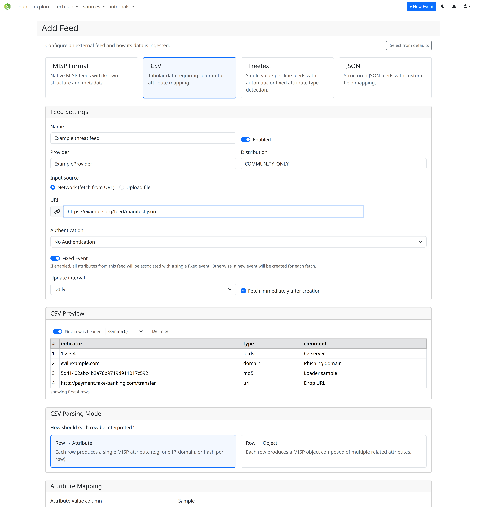

**2. Feed Settings** (shared across all formats):

| Field | Value | Notes |
|---|---|---|
| **Name** | `Cloudflare IPv4 ranges` | |
| **Enabled** | ✅ | Feed is active |
| **Provider** | `Cloudflare` | Source/organisation name |
| **Distribution** | *Your choice* | MISP distribution level for ingested attributes |
| **Input source** | **Network (fetch from URL)** | Or *Upload file* to ingest a local file once |
| **URI** | `https://www.cloudflare.com/ips-v4/` | The remote feed URL (Network mode) |
| **Fixed Event** | on | Append every fetch to one event — a single "Cloudflare IPv4 ranges" event that stays current |
| **Update interval** | **Daily** | Hourly / Daily / Weekly / No automatic updates |
| **Fetch immediately after creation** | ✅ | Also runs one fetch right away |

For authenticated feeds set **Authentication → Auth Header** (header name + secret). Cloudflare's list is public, so leave it off.

**3. CSV config.** Because the file is a bare list of CIDRs:

- **First row is header** → **off** (the first line is already data).
- **Delimiter** → `,` (there's only one column, so this doesn't matter here).

Click **Preview** to load the table — you'll see a single column of CIDR values.

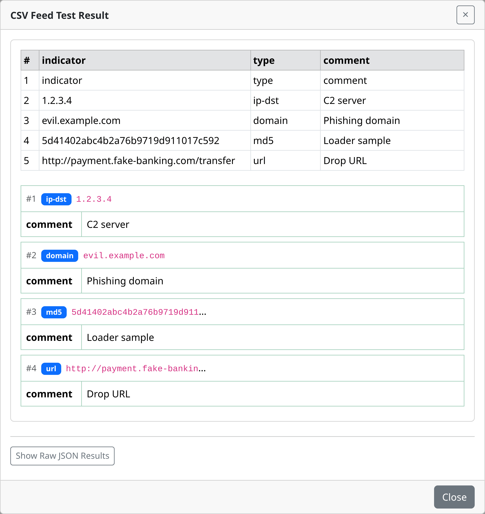

Then map the rows to attributes:

- Choose **Row → Attribute** (each line becomes one attribute; use **Row → Object** only for multi-field rows).
- Set the **value column** to the (only) column.
- Set the **type** to a **fixed** value of `ip-dst` — MISP's IP types accept CIDR notation.

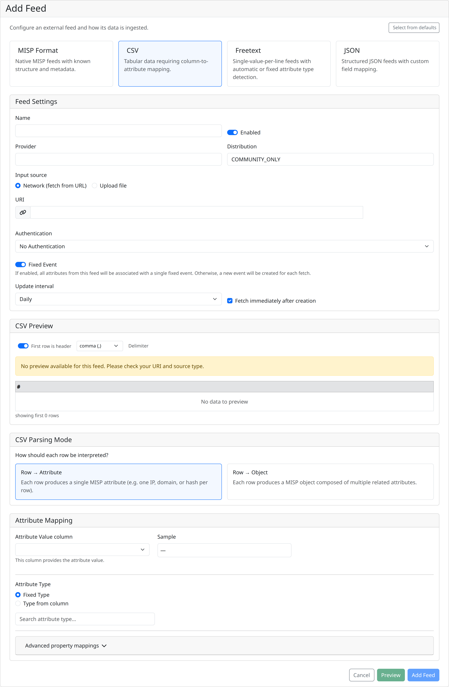

For richer feeds you can instead derive the **type** from a column and remap raw column values to MISP types under **Advanced** — for example mapping a `category` column's values onto different attribute types.

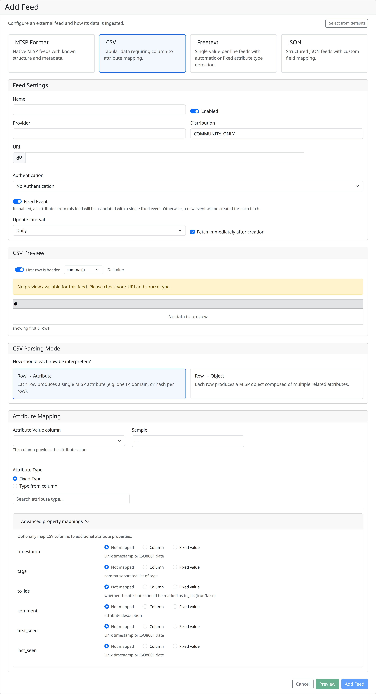

**4. Preview & create.** Confirm the previewed table and mapping look right, then click **Add Feed**.

### Option C — a JSON feed

Cloudflare also publishes the same ranges through its API as JSON: [`https://api.cloudflare.com/client/v4/ips`](https://api.cloudflare.com/client/v4/ips). The response nests the IPv4 ranges inside a `result` object, so it's a good example of the JSON format's **Items path** mapping:

```json
{
  "result": {
    "ipv4_cidrs": ["173.245.48.0/20", "103.21.244.0/22", "..."],
    "ipv6_cidrs": ["2400:cb00::/32", "..."],
    "etag": "38f79d050aa027e3be3865e495dcc9bc"
  },
  "success": true,
  "errors": [],
  "messages": []
}
```

**1. Pick a format.** Choose the **JSON Format** card.

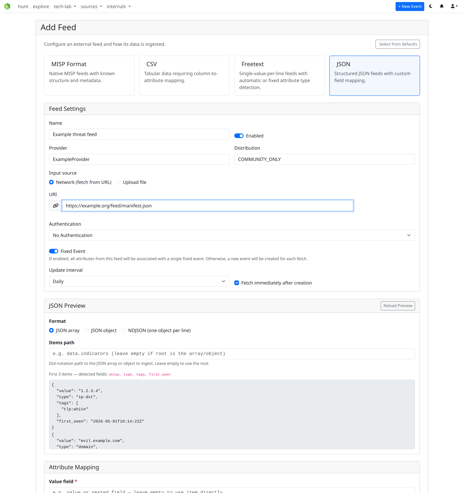

**2. Feed Settings** — same as above, but with:

| Field | Value |
|---|---|
| **Name** | `Cloudflare IPv4 ranges (JSON)` |
| **Provider** | `Cloudflare` |
| **URI** | `https://api.cloudflare.com/client/v4/ips` |

**3. JSON config.**

- **Structure** → **array** (once you point the items path at the CIDR list below, each element is a plain string).
- **Items path** → `result.ipv4_cidrs` — dot-notation to the array you want to ingest. Click **Preview** to fetch the response and confirm the path resolves to the list of CIDRs.

  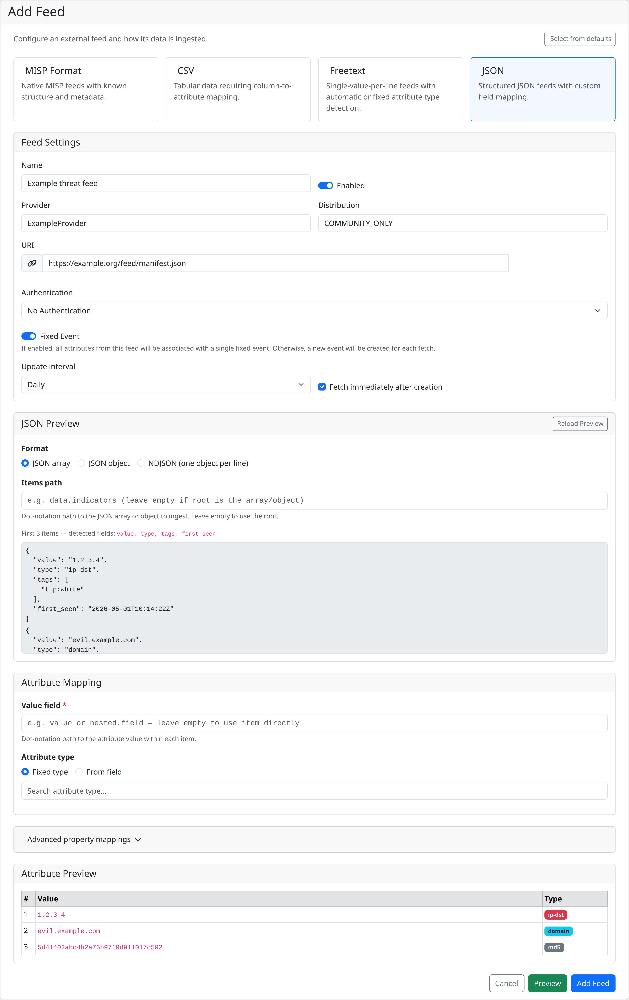

  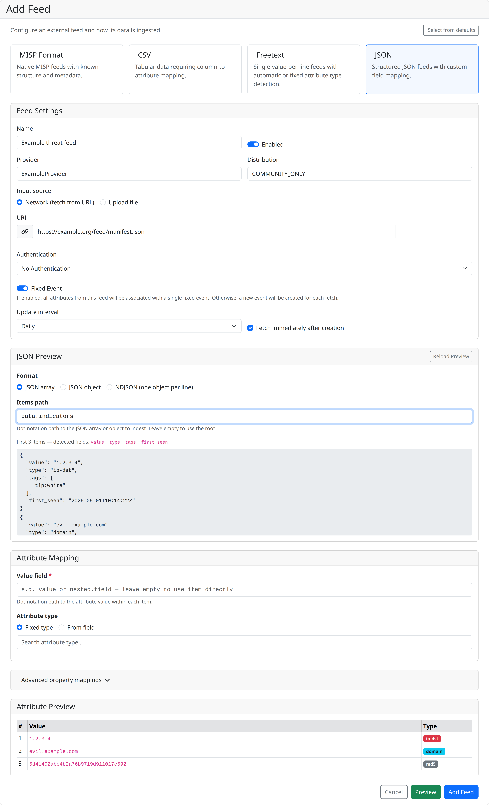

- **Value field** → leave empty / `.` — each item *is* the value (a bare string), not an object with fields. For object items you'd put the field name here (e.g. `ip`).
- **Attribute type** → fixed `ip-dst`.

  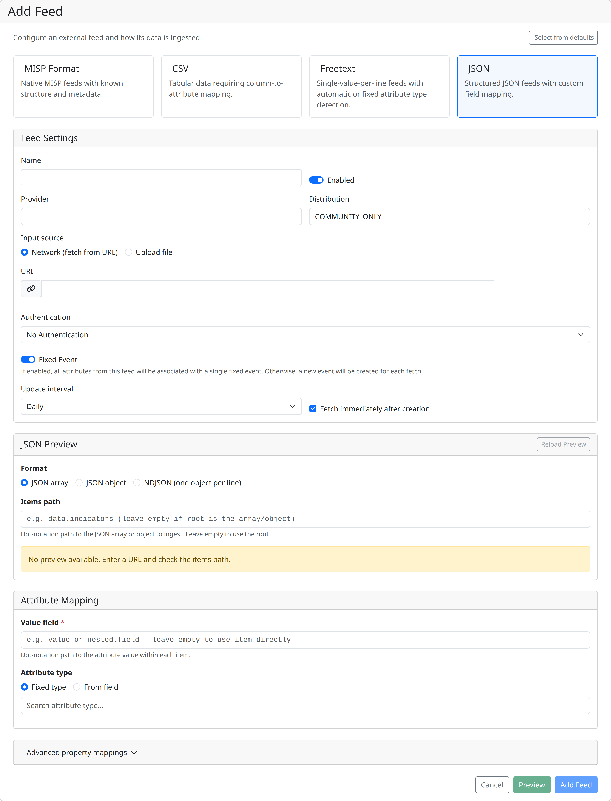

**4. Preview & create.** Confirm the resolved items and mapping, then click **Add Feed**.

### Fetch & manage

On the feed list each row has:

- an **enabled** toggle,
- **Fetch** (download icon) — enqueues an immediate `fetch_feed` Celery task (toast shows the task ID),
- **Preview feed events** (magnifying glass, MISP feeds only) — browse events in the feed and **Fetch event to local** individually,
- **View / Edit / Delete**.

A feed with an update interval creates a **RedBeat scheduled task** in Redis — view it under **internals → tasks** or in Flower. Deleting the feed removes its scheduled tasks too.

---

## 3. Explore your data

**Goal:** find the indicators you just ingested and pivot around them.

Go to **explore** (`/explore`). This is a **Lucene** search interface backed by **OpenSearch**, querying the `misp-events` and `misp-attributes` indices simultaneously.


### Write a query

Type a Lucene query and press **Enter**. Some examples:

| Query | Finds |
|---|---|
| `info:ransomware` | Events whose title contains "ransomware" |
| `type.keyword:ip*` | Attributes whose type starts with `ip` |
| `value:*.onion` | Onion-address indicators |
| `tags.name.keyword:"tlp:amber"` | Anything tagged TLP:AMBER |
| `expanded.ip2geo.country_iso_code:"RU"` | Attributes whose enriched geo resolves to Russia |
| `@timestamp:[2026-01-01 TO *]` | Documents indexed from 2026 onwards |
| `"admin@example.com"` | Exact phrase across all fields |

Click **Lucene query syntax supported** for an in-app cheatsheet.

### Filter and read results

- **Time range** filter — relative presets (last 15 min → last year) or absolute from/to; it appends an `@timestamp` range to your query.
- **Facet filters** per tab — *Organisation*, *Tags*, and (attributes) *Type*, ANDed into the query.
- **Sort** by *Relevance* or *Date*.
- **Include deleted** to also show soft-deleted records.

Results are split into three tabs with counts — **Events**, **Attributes**, **Correlations** — above a **timeline chart** you can click to drill into a single day. Event cards show info, threat level, analysis, org, attribute/object counts, and tags; attribute cards show type, category, an **IDS** badge, value, tags, and any geo enrichment.

### Save your work

The floppy-disk dropdown offers **Save Search** (persisted to your user settings) and **Save as Hunt** (next section). Recent searches are kept automatically in the sidebar; use the **Download** dropdown to export *all* matching documents as JSON.

---

## 4. Create a hunt

**Goal:** turn an ad-hoc search into a recurring, tracked detection.

A **Hunt** is a saved query with an index target and a run history, so you can watch how match counts evolve and get notified on change.

### The fastest way: promote a search

In **explore**, run a query you care about (e.g. `value:*powershell* AND value:*-enc*`), open the floppy-disk dropdown → **Save as Hunt**. The current query (plus any active time-range clause) is pre-filled — name it and confirm.


### Or create one directly

Go to **hunt** (`/hunts`) → **+ New Hunt**. Pick a **hunt type**:

| Type | Query is… | Searches |
|---|---|---|
| **opensearch** | a Lucene query | `attributes`, `events`, or `correlations` index |
| **cpe** | a CPE 2.3 string | CVEs for that product (via vulnerability.circl.lu) |
| **rulezet** | a Vuln ID (e.g. `CVE-2021-44228`) | detection rules from rulezet.org |
| **mitre-attack-pattern** | technique codes (e.g. `T1078, T1078.004`) | events/attributes tagged with those ATT&CK techniques |

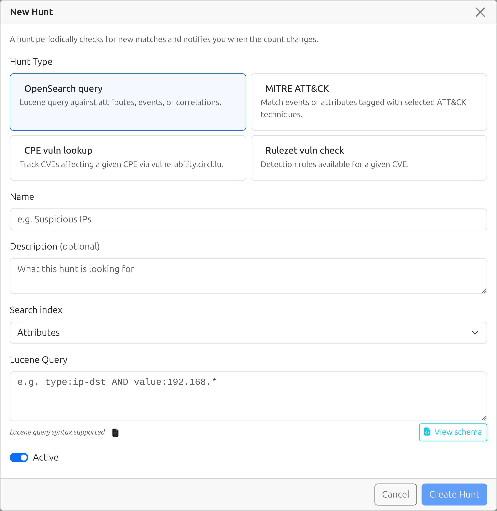

For our ransomware scenario, an **opensearch** hunt against the `attributes` index works well:

```json
POST /hunts/
{
  "name": "Encoded PowerShell",
  "description": "Detect encoded PowerShell command lines",
  "query": "value:*powershell* AND value:*-enc*",
  "hunt_type": "opensearch",
  "index_target": "attributes",
  "status": "active"
}
```

### Run, review, schedule

1. Click the **eye** icon on the new hunt, then **Run Now**.

   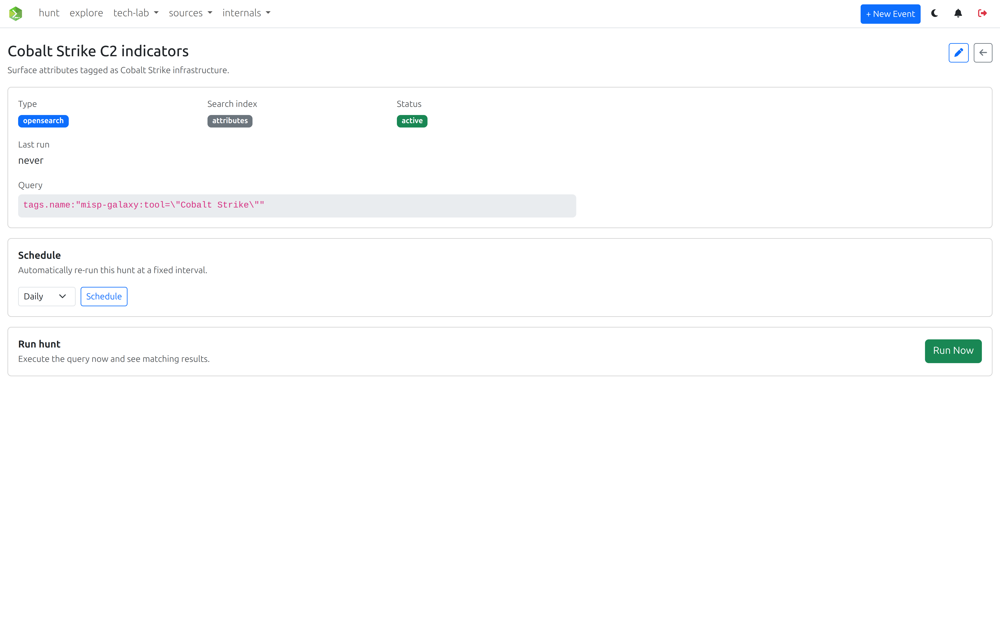

2. Once results are cached you see the matches and the **delta versus the previous run**.

   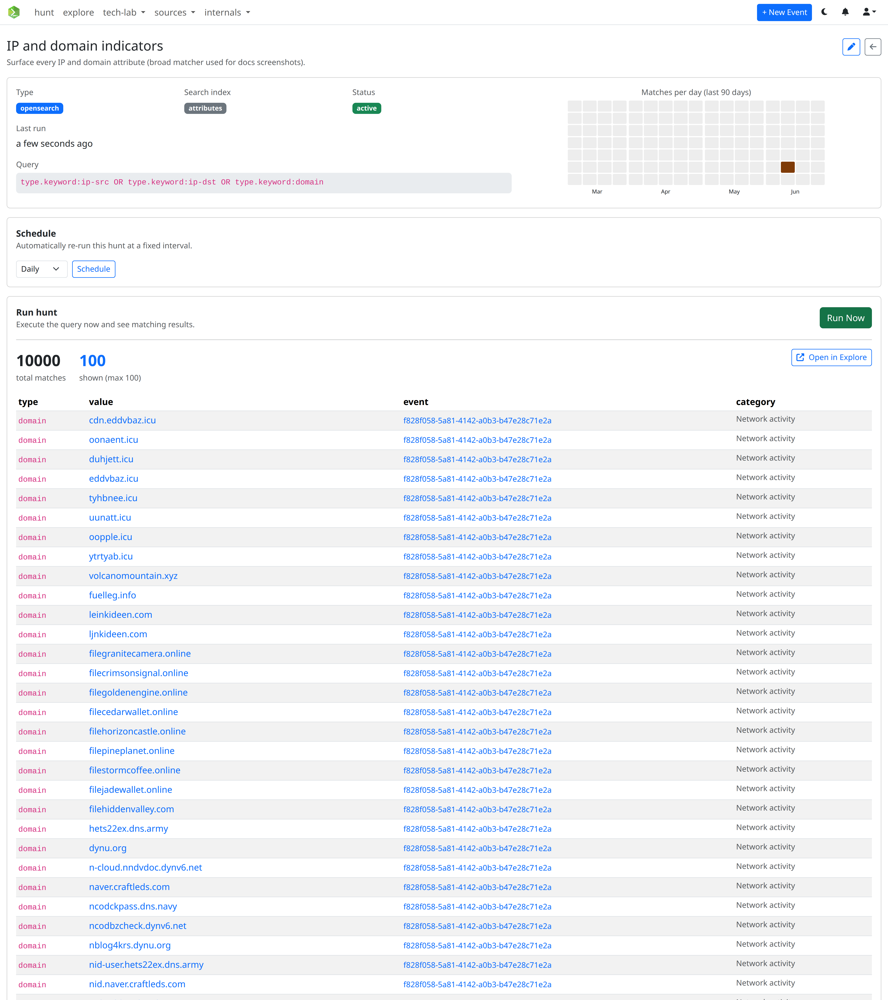

3. When a run produces new matches, you get a **notification** (bell icon in the navbar).

4. Use the **Schedule** widget for hourly/daily/weekly runs. For finer control, go to **internals → tasks → + New**, choose **run_task**, select your hunt, and set a fixed interval or a crontab expression.

   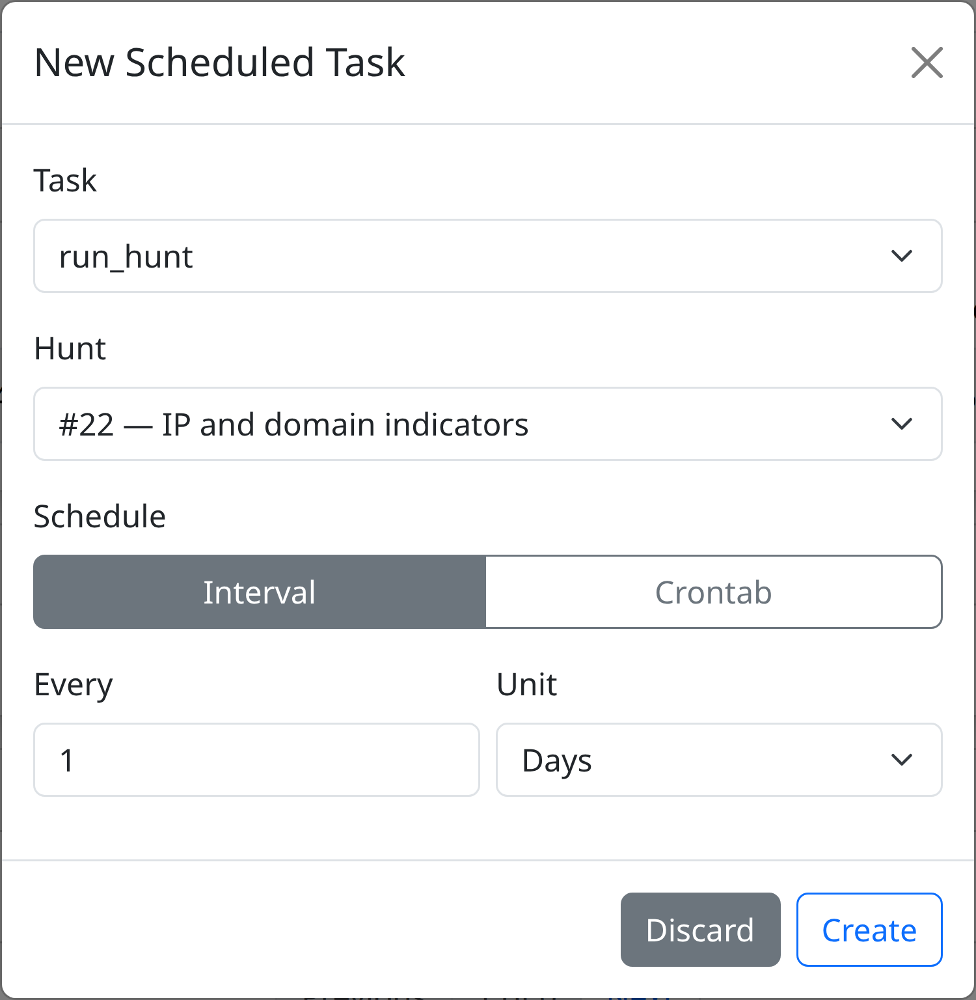

Paused hunts are skipped during scheduled runs. `GET /hunts/{id}/history` returns the match-count timeline — useful for spotting spikes.

---

## 5. Explore interactively in an analyst notebook

**Goal:** pivot through the data programmatically and build a shareable analysis.

Go to **tech-lab → notebooks** (`/tech-lab/notebooks`). Notebooks are Jupyter-style, running inside misp-workbench with a pre-imported SDK — the bound instance **`mwlab`** — giving typed read access to events, attributes, objects, correlations, sightings, and enrichment modules.

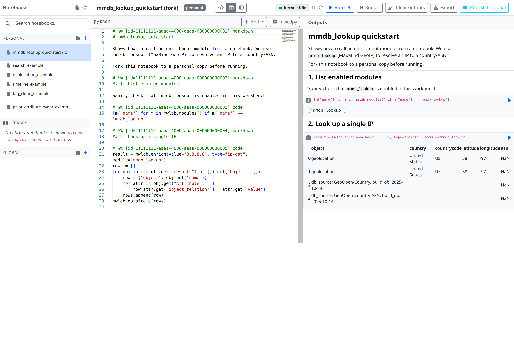

The layout is two panes: a **file tree** on the left (folders + notebooks, grouped **Pinned / Personal / Library / Global**) and a Monaco editor on the right showing the notebook as one scrolling document with `# %%` cell delimiters and inline outputs.

To start, click the **New notebook** (+) button in the *Personal* section, give it a **Name** and optional **Description** in the dialog, and hit **Create** — you get a starter cell with `mwlab` ready to use. Use the **Add** dropdown in the editor to insert further **Code** or **Markdown** cells, and **Run cell** (or **Shift+Enter**) / **Run all** to execute. Edits auto-save.

### A short analysis session

**Find recent IOCs by tag:**

```python
events = mwlab.search_events(tags=["tlp:clear"], size=20)
mwlab.dataframe(events)
```

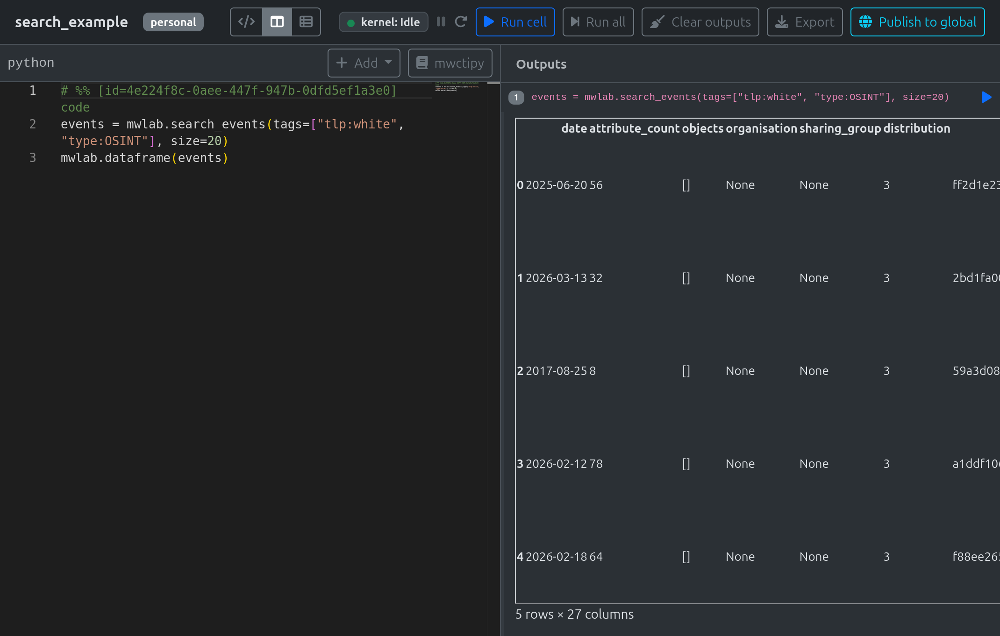

**Pivot from an attribute to its event:**

```python
hits = mwlab.search_attributes(value="*.com", type="domain", size=20)
for attr in hits:
    event = mwlab.get_event(attr["event_uuid"])
    print(attr["value"], "→", attr["uuid"], "→", event["info"])
```

**Enrich / geolocate an indicator** (audited under your identity):

```python
result = mwlab.enrich("8.8.8.8", "ip-src", "mmdb_lookup")
```

**Build a timeline visual:**

```python
from IPython.display import HTML
events = mwlab.search_events(query="ransomware", size=10)
HTML(render.timeline(events))
```

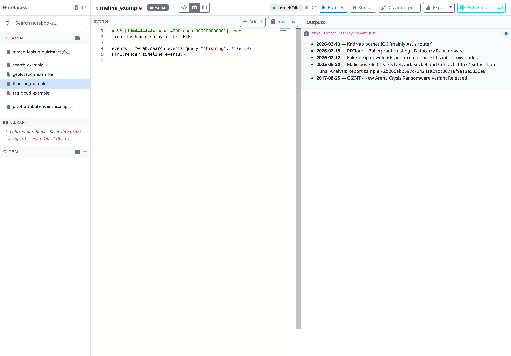

Notes:

- Each cell runs in a long-lived kernel (with **Interrupt** / **Restart** controls); state persists until you restart it or it idles out (~30 min default).
- Notebooks are **read-only** on the data in this version — great for exploration, not for writing back.
- **Visibility** has three levels: **personal** (private, editable), **global** (anyone can view/run; only the owner edits — others **Fork to personal**), and **library** (read-only prebuilt notebooks — not runnable until you fork them). Owners can **Publish to global** to share a copy.
- **Export** to `.ipynb` (opens in stock JupyterLab) or to a rendered **PDF**; **Import** an `.ipynb` to create a personal notebook.

> Notebooks are the *pull* side of analysis (you exploring data). Its sibling, **tech-lab → reactor scripts**, is the *push* side — Python that fires automatically when platform events happen.

---

## 6. Enrich indicators with misp-modules

**Goal:** add context to an indicator — geolocation, DNS resolution, threat-intel lookups — and fold the new data back into the event.

misp-workbench delegates enrichment to a running [**misp-modules**](https://github.com/MISP/misp-modules) service over HTTP. When you enrich an attribute, the workbench queries one or more **expansion** modules and hands you back new attributes and MISP objects that you can selectively keep.

### Connect to the misp-modules service

The connection is configured with two environment variables (see `.env.dev`):

| Variable | Default | Description |
|---|---|---|
| `MODULES_HOST` | `localhost` | Hostname of the misp-modules service |
| `MODULES_PORT` | `6666` | Port of the misp-modules service |

The dev compose stack already ships a misp-modules container, so this works out of the box.

### Enable and configure modules

Go to **internals → modules**. Every module the service exposes is listed with its name, author, version, and description. Use the search box or the **Only enabled** toggle to filter.

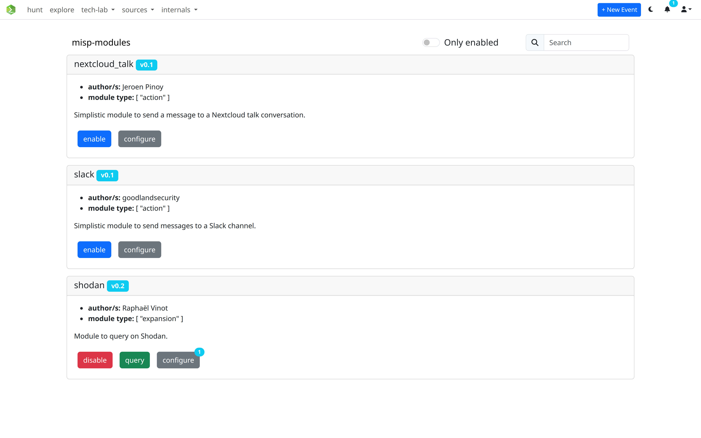

- Click **enable** on a module card to make it available for enrichment queries (disabled modules are skipped).
- If a module needs credentials (e.g. a VirusTotal API key), a **configure** button appears — set the key-value pairs there; they're stored in the DB and merged into every query automatically.
- Click **query** on an enabled module to fire a test query straight from the settings page.

For our ransomware scenario, enable a couple of no-key modules to start — e.g. **dns** (resolve a domain) and **mmdb_lookup** / an IP-geolocation module.

### Enrich an attribute

1. Open an event and go to its **attributes** list (from **explore**, click into an event, or use one you pulled from the feed/server).
2. Click the **Enrich** (magic-wand) action on an attribute — say a `domain` or `ip-src`.

   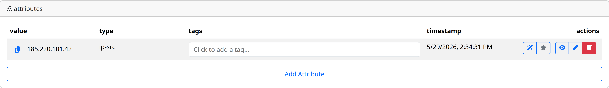

3. The **enrichment modal** shows the attribute plus every enabled module. Tick the modules you want (or select-all in the header) and click **Query**.

   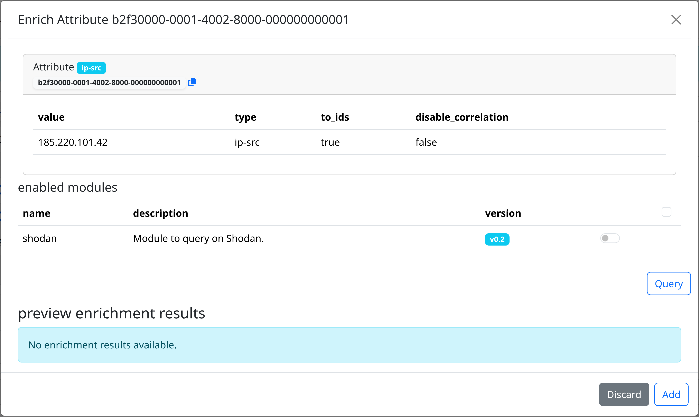

4. Results come back grouped by module. Each result is either an **Attribute** (a single value — a resolved IP, a hash) or an **Object** (a structured group of attributes with references back to the source attribute).

   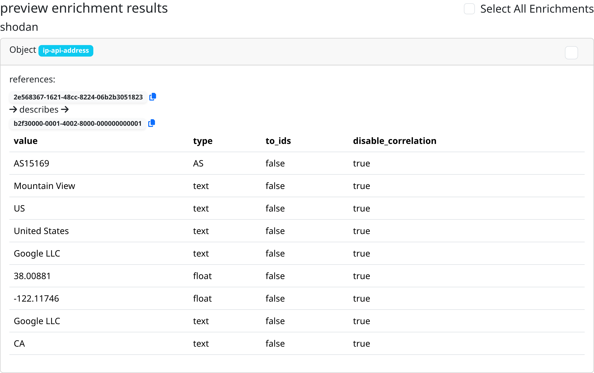

5. Tick the results you want to keep (or **Select All Enrichments**), then click **Add**. The selected attributes and objects are created in the event.

New attributes inherit the source attribute's `event_uuid`, `distribution`, and `sharing_group_id`, so the enrichment lands in the same event with consistent sharing.

### From code

The same capability is available in [notebooks](#5-explore-interactively-in-an-analyst-notebook) via `mwlab.enrich(...)` and directly over the API:

```json
POST /modules/query
{
  "module": "dns",
  "attribute": { "type": "domain", "value": "example.com" }
}
```

The stored module config is merged in automatically — you don't pass API keys in the request. Enable/configure a module with `PATCH /modules/{name}`, and list them with `GET /modules/?enabled=true`.

> **Tip.** misp-modules also has *import* and *export* module types; misp-workbench currently uses **expansion** modules for attribute enrichment.

---

## 7. Query your intel from an AI assistant (MCP server)

**Goal:** ask questions about your threat intel in plain language from Claude, Cursor, or VS Code — the assistant queries misp-workbench directly.

misp-workbench exposes a [**Model Context Protocol (MCP)**](https://modelcontextprotocol.io/) server at **`/mcp`** over the Streamable HTTP transport. Through it, an AI assistant can:

- **tools** — search events, attributes, correlations, sightings, hunts, and reports; detect indicator types; enrich indicators; pull statistics.
- **resources** — static reference data (attribute types, taxonomies, galaxies, query-syntax cheat sheet).
- **prompts** — reusable analysis templates (`threat_report`, `ioc_lookup`, `threat_actor_profile`, `country_exposure`, `daily_summary`, `enrich_indicator_prompt`).

### 1. Get a client config with a scoped token

Call `/mcp/config` with your API token to generate a ready-to-paste client configuration containing an **MCP-scoped bearer token** (scoped to `mcp:*` only — no REST API access):

```bash
curl -s http://localhost:8000/mcp/config \
  -H "Authorization: Bearer <your-api-token>" | jq .
```

```json
{
  "mcpServers": {
    "misp-workbench": {
      "type": "http",
      "url": "https://your-instance/mcp",
      "headers": { "Authorization": "Bearer <mcp-scoped-token>" }
    }
  }
}
```

> Generating the config requires the `mcp:config` scope. Admins (`perm_admin`) get all `mcp:*` scopes automatically.

### 2. Add the server to your client

**Claude Code** — add it from any terminal:

```bash
claude mcp add --transport http \
  --header "Authorization: Bearer <mcp-scoped-token>" \
  misp-workbench https://your-instance/mcp
```

Use `--scope user` to make it available in every project (stored in `~/.claude.json`); the default is project scope (`.mcp.json` in the current directory).

**Claude Desktop** — save the `mcpServers` block to `~/.claude/mcp.json`.

**Cursor / VS Code** — add it under *Settings → MCP Servers* or paste the same `type: http` block into `.cursor/mcp.json`.

### 3. Local dev (no auth)

The dev stack defaults to `MCP_AUTH_ENABLED=false`, so no token is needed locally:

```bash
claude mcp add --transport http misp-workbench http://localhost:8000/mcp
```

> ⚠️ **Always set `MCP_AUTH_ENABLED=true` in production.** Without it, any client with network access can call every tool unauthenticated.

### 4. Verify and use it

```bash
claude mcp list          # confirm misp-workbench appears
```

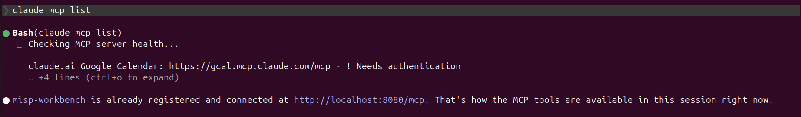

Start a session (`claude`), type `/mcp` to see the connected server and its tool count, then just ask — tying back to our ransomware scenario:

```
> search for ransomware events from the last 30 days
> look up the indicator 185.220.101.45 and check for correlations
> generate a threat report for APT28
> enrich 8.8.8.8 with geolocation
```

The assistant picks the right tools (`search_events`, `get_correlations`, `enrich_indicator`, …) and combines the results into an answer. This is the same data you explored in the UI — now driven conversationally.

---

## 8. Round it out

### Create your own event

Click **+ Add Event** (top-right) → set **info**, **date**, **distribution**, **threat level**, and **analysis**, then **Create**. On the event page you can add **tags**, **attributes**, **objects**, and **reports**, toggle **published**, and toggle **correlate** (correlation engine on/off for the event).

For bulk indicator entry, use **Batch Import** to paste a list of IOCs and attach them to an event in one operation.

### Correlations

misp-workbench correlates attribute values across events automatically. See them in the **Correlations** tab of Explore, the **Correlated Events** panel on an event page, or the dedicated **internals → correlations** view.

### Export

Under **internals → exports → + Add Export** you can produce file-based exports in **JSON, CSV, MISP, or STIX 2.1** format.

---

## Where to go next

| Topic | Docs |
|---|---|
| Feed formats in depth | [../docs/features/feeds/index.md](../docs/features/feeds/index.md) |
| Explore & Lucene | [../docs/features/explore.md](../docs/features/explore.md) |
| Hunts (all types & API) | [../docs/features/hunts.md](../docs/features/hunts.md) |
| Notebooks & the `mwlab` SDK | [../docs/features/tech-lab/notebooks.md](../docs/features/tech-lab/notebooks.md) |
| Reactor automation | [../docs/features/tech-lab/reactor.md](../docs/features/tech-lab/reactor.md) |
| Enrichments (misp-modules) | [../docs/features/enrichments.md](../docs/features/enrichments.md) |
| MCP server (AI assistants) | [../docs/features/mcp/index.md](../docs/features/mcp/index.md) |
| REST API reference | http://localhost:8000/docs |

You now have a working intel pipeline: **servers** and **feeds** bringing data in, **explore** and **hunts** finding what matters, and **notebooks** for deep-dive analysis.
